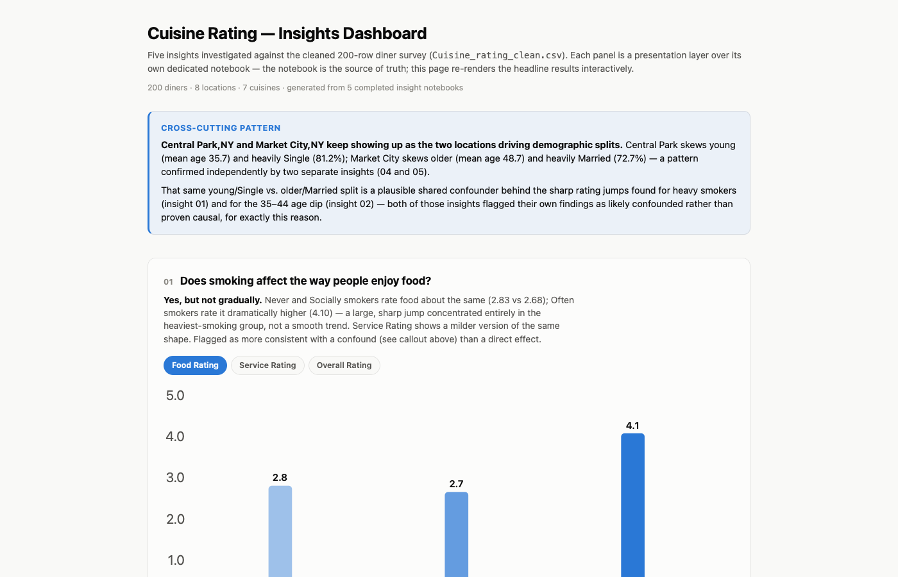
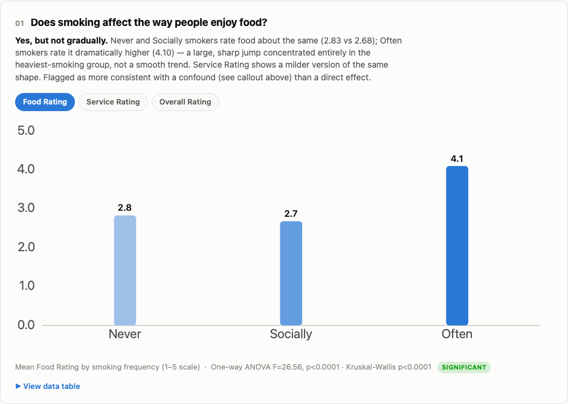

# Data Analysis Skills for Claude Code

Three [Claude Code skills](https://docs.claude.com/en/docs/claude-code/skills) that turn Claude into a
careful data analyst. Instead of silently cleaning or analysing a dataset, Claude walks you through each
step, asks before every non-trivial decision, and saves the work as Jupyter notebooks.

The repo also contains a full worked example: a 200-row restaurant survey (`Cuisine_rating.csv`) taken
from raw data to five answered questions and an interactive dashboard, using only these skills.

## The workflow

| Step | Skill | What it does |
|---|---|---|
| 1 | **`dataset-cleanup`** `.claude/skills/0.1_cleaning_data` | Cleans a raw dataset without touching the original: duplicates → missing values → outliers → category consistency → data types. Asks about one issue at a time and versions every run (`_clean`, `_clean_v2`…). |
| 2 | **`first-analysis`** `.claude/skills/0.2_initial_analysis` | A standard first pass over a new dataset: structure, data quality, column roles, distributions, business metrics and suggested questions, saved as a notebook. |
| 3 | **`deeper-analysis`** `.claude/skills/0.3_deep_analysis` | Answers one question at a time against the cleaned data. Confirms the scope first, picks the right statistical depth, states assumptions and caveats, and writes one numbered notebook per question with a plain-language conclusion. |

Two helper skills support them:

- **`skill-spec`**: the `SKILL.md` format rules, used when writing or reviewing skills
- **`verify`**: checks that every skill is valid and every notebook still has its data

## Worked example: cuisine ratings

| File | What it is |
|---|---|
| `Cuisine_rating.csv` | Raw survey: 200 diners, 8 New York locations, 7 cuisines |
| `Cuisine_rating_cleaning.ipynb` → `Cuisine_rating_clean.csv` | Step 1: the cleaning run and its output |
| `cuisine_rating_analysis.ipynb` | Step 2: first-pass analysis |
| `01_` … `05_*.ipynb` | Step 3: one notebook per question (below) |
| `analysis_summary.ipynb` | Index of every question with its headline conclusion |
| `dashboard.html` | Interactive dashboard of the five results; open it in a browser |

The five questions:

1. **Does smoking affect how people enjoy food?** Yes, but only for heavy smokers (4.1 vs. 2.7–2.8 on a 1–5 scale), more likely a confound than a direct effect.
2. **Which ages enjoy food and service more?** Under-25s rate food highest, 45–54 rate service highest, and 35–44 is the low point on both.
3. **Which cuisines are most popular by location and gender?** No cuisine dominates anywhere; Italian is least popular overall.
4. **Does year of birth relate to budget and area?** 25–34 year-olds budget lowest; the age difference between areas isn't significant.
5. **How does marital status vary by area?** Central Park skews Single (81%), Market City skews Married (73%).

## Using the skills

Skills in `.claude/skills/` are picked up automatically when you run Claude Code in this folder. To use
them in every project, copy the skill folders to `~/.claude/skills/`.

Then just describe what you want, for example:

- *"Clean `sales.csv` and get it ready for analysis"* → `dataset-cleanup`
- *"Give me a first look at this dataset"* → `first-analysis`
- *"Why did revenue drop in Q3?"* → `deeper-analysis`
